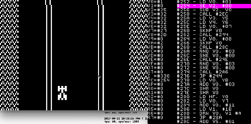

[](https://rsredsq.github.io/Chip8Emu/)

# Chip8Emu
CHIP-8 is an assembler, disassembler, debugger, and emulator for the [COSMAC ELF](https://en.wikipedia.org/wiki/RCA_1802) [CHIP-8](https://en.wikipedia.org/wiki/CHIP-8) interpreter. 

Chip-8Emu is written in C++, uses [SDL](https://www.libsdl.org/) for its rendering, input handling, and audio and uses [pcre](http://www.pcre.org/) for parsing assembly. It should easily run on Windows and OSX.

Athors: [rsredsq](https://github.com/rsredsq) and [scrat98](https://github.com/scrat98)

## Building
**You must have the latest version [cmake](https://cmake.org/) and have [GCC](https://gcc.gnu.org/) compile for the OSX or have [Visual Studio 2017](https://www.visualstudio.com/ru/downloads/) for the Windows**
* Clone or [download](https://github.com/rsredsq/Chip8Emu/archive/master.zip) source code
* Run the script file depending on your operating system. buildWIN.bat for Windows and buildOSX.sh for OSX
* Have fun!

# What's a Chip-8?
Chip-8 is a simple, interpreted, programming language which was first used on some do-it-yourself computer systems in the late 1970s and early 1980s. The COSMAC VIP, DREAM 6800, and ETI 660 computers are a few examples. These computers typically were designed to use a television as a display, had between 1 and 4K of RAM, and used a 16-key hexadecimal keypad for input. The interpreter took up only 512 bytes of memory, and programs, which were entered into the computer in hexadecimal, were even smaller. CHIP-8 was used to create games such as Pong, Tetris, Space Invaders, etc.

In 1990 Andreas Gustafsson wrote interpreter CHIP-8 for the graphing calculator HP-48. This version was called CHIP-48.

In 1991 Erik Bryntse added to the language several innovations that have resulted in a 2-fold increase in screen resolution in the games and use scrolling. This version was called Super Chip-8.

Currently, there are more and MegaChip developed by Revival Studios. In this version added color graphics and sound.

## Memory
CHIP-8 has 4 KB of memory (addresses 0x000h-0xFFFh). The first 512 bytes (addresses 0x000h-0x200h) are reserved for the interpreter, so the game is available only 3,584 bytes. Accordingly, the game is in memory starting at address 0x200h.

```
+---------------+= 0xFFF (4095) End of Chip-8 RAM
|               |
|               |
|               |
|               |
|               |
| 0x200 to 0xFFF|
|     Chip-8    |
| Program / Data|
|     Space     |
|               |
|               |
|               |
|               |
|               |
|               |
|               |
+---------------+= 0x200 (512) Start of most Chip-8 programs
| 0x000 to 0x1FF|
| Reserved for  |
|  interpreter  |
+---------------+= 0x000 (0) Start of Chip-8 RAM
```

## Screen
The original implementation of the CHIP-8 has a monochrome(black and white) screen size 64х32 pixel. Super Chip in addition to the main advanced mode is 128x64. 

Chip-8 draws graphics on screen through the use of sprites. A sprite is a group of bytes which are a binary representation of the desired picture. Chip-8 sprites may be up to 15 bytes, for a possible sprite size of 8x15. The interpreter provides 16 predefined sprites with a size of 4x5 pixels(8x10 for the Super Chip). It is a hexadecimal number from 0 to F.

## Keyboard
Computers which used the original CHIP-8 had 16-key keyboard. for convenience, all the keys were located to the left

```
Original              In the Emulator
+-+-+-+-+                +-+-+-+-+
|1|2|3|C|                |1|2|3|4|
+-+-+-+-+                +-+-+-+-+
|4|5|6|D|                |Q|W|E|R|
+-+-+-+-+       =>       +-+-+-+-+
|7|8|9|E|                |A|S|D|F|
+-+-+-+-+                +-+-+-+-+
|A|0|B|F|                |Z|X|C|V|
+-+-+-+-+                +-+-+-+-+
```
## Registers
The CHIP-8 has 16, 8-bit virtual registers: `V0`, `V1`, `V2`, `V3`, `V4`, `V5`, `V6`, `V7`, `V8`, `V9`, `VA`, `VB`, `VC`, `VD`, `VE`, and `VF`. All of these are considered general purpose registers except for `VF` which is used for carry, borrow, shift, overflow, and collision detection.
 
There is a single, 16-bit address register: `I`, which is used for reading from - and writing to - memory.

Last, there are two, 8-bit, timer registers (`DT` for delays and `ST` for sounds) that continuously count down at 60 Hz. The delay timer is good for time limiting your game or waiting brief periods of time. While the sound timer is non-zero a tone will be emitted.

Finally, the Super CHIP-8, which was used on the HP-48 calculators, contained 8, 8-bit, user-flag registers: `R0`-`R7`. These cannot be directly used, but registers `V0`-`V7` can be saved to - and loaded from - them. This can be quite handy at times. See the `LD R, VX` and `LD VX, R` instructions below.

## Stack & CPU
In the stack are saved the return address in function calls. The original interpreter had 12 levels of nesting stack. Now we are decided to do 16. Each value in the stack has a size of 2 bytes.

The processor executes 1000 opcodes per second

## Timers & Sound
Chip-8 provides 2 timers, a delay timer and a sound timer.

The delay timer is active whenever the delay timer register (DT) is non-zero. This timer does nothing more than subtract 1 from the value of DT at a rate of 60Hz. When DT reaches 0, it deactivates.

The sound timer is active whenever the sound timer register (ST) is non-zero. This timer also decrements at a rate of 60Hz, however, as long as ST's value is greater than zero, the Chip-8 buzzer will sound. When ST reaches zero, the sound timer deactivates.

## Instructions
| Opcode | Mnemonic      | Description
|:-------|:--------------|:---------------------------------------------------------------
| 00E0	  | CLS	          | Clear video memory
| 00EE	  | RET	          | Return from subroutine
| 0NNN	  | SYS           | NNN	Call CDP1802 subroutine at NNN |DELETED|
| 00BN	  | SCU           | N	Scroll up N pixels (N/2 pixels in low res mode)
| 00CN	  | SCD           | N	Scroll down N pixels (N/2 pixels in low res mode)
| 00FB	  | SCR	          | Scroll right 4 pixels (2 pixels in low res mode)
| 00FC	  | SCL	          | Scroll left 4 pixels (2 pixels in low res mode)
| 00FD	  | EXIT	         | Exit the interpreter; this causes the VM to infinite loop
| 00FE	  | LOW	          | Enter low resolution (64x32) mode; this is the default mode
| 00FF	  | HIGH	         | Enter high resolution (128x64) mode
| 1NNN	  | JP            | NNN	Jump to address NNN
| 2NNN	  | CALL          | NNN	Call CHIP-8 subroutine at NNN
| 3XNN	  | SE            | VX, NN	Skip next instruction if VX == NN
| 4XNN	  | SNE           | VX, NN	Skip next instruction if VX != NN
| 5XY0	  | SE            | VX, VY	Skip next instruction if VX == VY
| 5XY1	  | SGT           | VX, VY	Skip next instruction if VX > VY
| 5XY2	  | SLT           | VX, VY	Skip next instruction if VX < VY
| 6XNN	  | LD VX, NN	    | VX = NN
| 7XNN	  | ADD VX, NN	   | VX = VX + NN
| 8XY0	  | LD VX, VY	    | VX = VY
| 8XY1	  | OR VX, VY	    | VX = VX OR VY
| 8XY2	  | AND VX, VY	   | VX = VX AND VY
| 8XY3	  | XOR VX, VY	   | VX = VX XOR VY
| 8XY4	  | ADD VX, VY	   | VX = VX + VY; VF = 1 if overflow else 0
| 8XY5	  | SUB VX, VY	   | VX = VX - VY; VF = 1 if not borrow else 0
| 8XY6	  | SHR VX	       | VF = LSB(VX); VX = VX » 1
| 8XY7	  | SUBN VX, VY	  | VX = VY - VX; VF = 1 if not borrow else 0
| 8XYE	  | SHL VX	       | VF = MSB(VX); VX = VX « 1
| 9XY0	  | SNE VX, VY 	  | Skip next instruction if VX != VY
| ANNN	  | LD I, NNN	    | I = NNN
| BNNN	  | JP V0, NNN	   | Jump to address NNN + V0
| CXNN	  | RND VX, NN	   | VX = RND() AND NN
| DXYN	  | DRW VX, VY, N	| Draw 8xN sprite at I to VX, VY; VF = 1 if collision else 0
| DXY0	  | DRW VX, VY, 0	| Draw a 16x16 sprite at I to VX, VY (8x16 in low res mode)
| EX9E	  | SKP VX	       | Skip next instruction if key(VX) is pressed
| EXA1	  | SKNP VX	      | Skip next instruction if key(VX) is not pressed
| FX07	  | LD VX, DT	    | VX = DT
| FX0A	  | LD VX, K	     | Wait for key press, store key pressed in VX
| FX15	  | LD DT, VX	    | DT = VX
| FX18	  | LD ST, VX	    | ST = VX
| FX1E	  | ADD I, VX	    | I = I + VX; VF = 1 if I > 0xFFF else 0
| FX29	  | LD F, VX	     | I = address of 4x5 font character in VX (0..F)
| FX33	  | LD B, VX	     | Store BCD representation of VX at I (100), I+1 (10), and I+2 (1); I remains unchanged
| FX55	  | LD [I], VX	   | Store V0..VX (inclusive) to memory starting at I; I remains unchanged
| FX65	  | LD VX, [I]	   | Load V0..VX (inclusive) from memory starting at I; I remains unchanged
| FX30	  | LD HF, VX	    | I = address of 8x10 font character in VX (0..F)
| FX75	  | LD R, VX	     | Store V0..VX (inclusive) into HP-RPL user flags R0..RX (X < 8)
| FX85	  | LD VX, R	     | Load V0..VX (inclusive) from HP-RPL user flags R0..RX (X < 8)

# Emulator
| Comamnd  |	Description
|:---------|:--------------
|`F1`      | Load ROM
|`Ctr + R` | Restart ROM  
|`Ctr + G` | Open debug window

# Debugger
| Comamnd |	Description
|:--------|:--------------
|`Space`  | Pause
|`N`      | Next instruction 

# Assembler
If you want to try creating your own game, then this is what you need. The sample programs can be viewed [here](https://github.com/rsredsq/Chip8Emu/tree/master/games/tests). This is a wonderful interpreter, who will point out your mistakes, making it easier to create games

## Syntax
<table>
  <tr>
    <th>Command</th>
    <th>Syntax</th>
    <th>Example</th>
  </tr>
  
  <tr>
    <td><code>Labels</code></td>
    <td>label:</td>
    <td>start:</td>
  </tr>
  
  <tr>
    <td rowspan="3"><code>Bytes</code></td>
    <td rowspan="3">byte</td>
    <td><code>hex</code> byte #A3</td>
  </tr>
  <tr>
    <td><code>bin</code> byte %10010011</td>
  </tr>
  <tr>
    <td><code>dec</code> byte 125</td>
  </tr>
  
  <tr>
    <td><code>Define</code></td>
    <td>equ [name] [value]</td>
    <td>equ up 5</td>
  </tr>
  
  <tr>
    <td><code>Variable</code></td>
    <td>var [name] [register]</td>
    <td>var speed v3</td>
  </tr>
  
  <tr>
    <td><code>Comments</code></td>
    <td>;</td>
    <td>; this is comment</td>
  </tr>  
</table>

## Code generate
Using the command line, run chip8asm.exe by the assembler file name as a parameter. As a result, you will get a bin file, and two log file.

`Assembler.txt` - it's a parsed file for greater clarity (was done for a static code analyzer, but it was not completed yet)
`Assembler.log` - it's a log with all errors, variables, labels, and other information

# DisAssembler


# Thanks for watching
If you have any questions or find a bug, please contact us: [rsredsq](https://github.com/rsredsq) or [scrat98](https://github.com/scrat98). 
